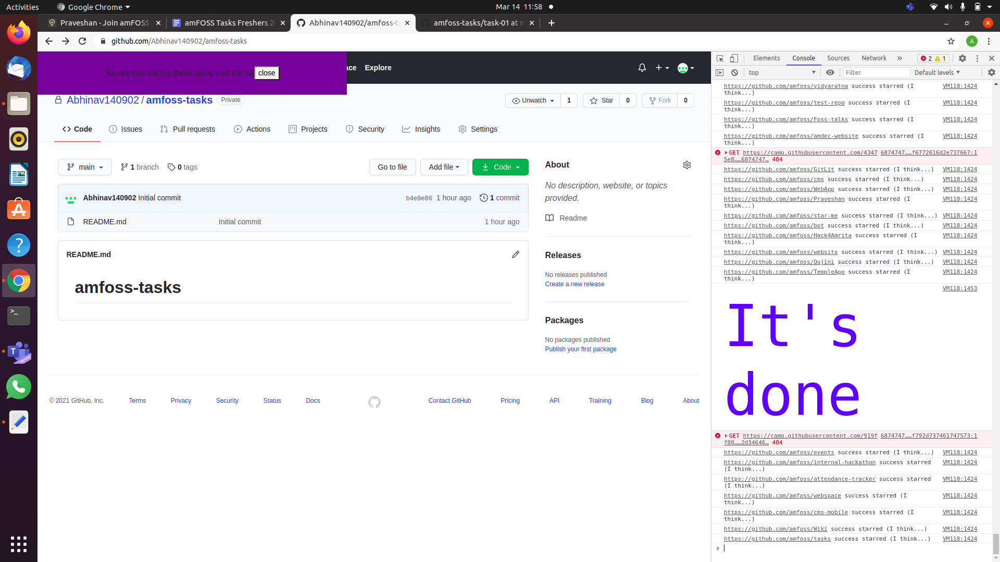

# Starring amFoss repositories
## Procedure 
- Firstly, I signed into my github account.
- Then, copied the entire script from star.user.js 
- Opened the Console tab in the Developer tools by pressing "ctrl+shift+I".
- Then pasted the entire script in the Console tab and pressed enter.
- The script took a few minutes to run.
- After the execution, it displayed "it's done" in blue colour in the console itself.

# Screenshot

